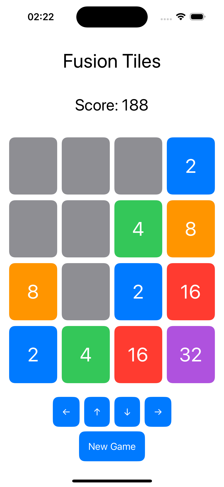
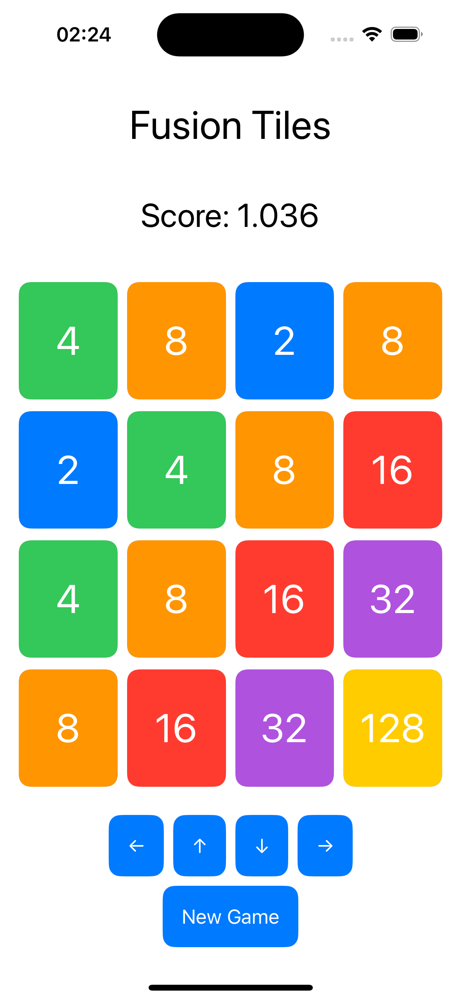

# FusionTiles - A 2048 Clone

FusionTiles is a fun and addictive number puzzle game inspired by the classic 2048 game. The objective of the game is to slide and combine tiles with the same numbers to create higher numbered tiles. The game ends when there are no more moves available on the grid.

## Features

- **Grid:** A 4x4 grid where the game takes place.
- **Tiles:** Randomly generated tiles with values of 2 or 4.
- **Sliding and Combining:** Slide tiles in four directions (left, right, up, down) to combine tiles with the same number.
- **Score Tracking:** Keep track of the player's score, which increases with each tile combination.
- **New Game:** Reset the game at any time to start fresh.
- **Game Over Detection:** The game automatically detects when there are no more moves available.

## Screenshots




## How to Play

1. Use the arrow buttons to slide the tiles in the desired direction.
2. When two tiles with the same number collide, they merge into a single tile with the combined value.
3. Each move adds a new tile with a value of 2 or 4 to the grid.
4. The game ends when there are no more valid moves.
5. Try to achieve the highest score possible!

## Installation

To run FusionTiles on your local machine, follow these steps:

1. Clone the repository:
    ```bash
    git clone https://github.com/yourusername/FusionTiles.git
    ```

2. Open the project in Xcode:
    ```bash
    cd FusionTiles
    open FusionTiles.xcodeproj
    ```

3. Build and run the project on the simulator or a physical device.

## Requirements

- Xcode 12.0 or later
- iOS 14.0 or later
- Swift 5.0 or later

## Project Structure

- `FusionTilesApp.swift`: The main entry point of the app.
- `ContentView.swift`: The initial content view.
- `GameView.swift`: The main game view containing the grid and control buttons.
- `GridView.swift`: The grid view displaying the tiles.
- `TileView.swift`: The view for individual tiles.
- `GameModel.swift`: The game logic including tile sliding, combining, and score tracking.
- `TileModel.swift`: The model representing individual tiles.

## Contributing

Feel free to fork this repository and submit pull requests. Any contributions to improve the game are welcome!

## License

This project is licensed under the MIT License. See the [LICENSE](LICENSE) file for details.

## Acknowledgements

- Inspired by the original [2048 game](https://github.com/gabrielecirulli/2048) created by Gabriele Cirulli.

## Contact

For any inquiries or feedback, please reach out to [your.email@example.com](mailto:your.email@example.com).

---

Enjoy playing FusionTiles and try to beat your high score!
